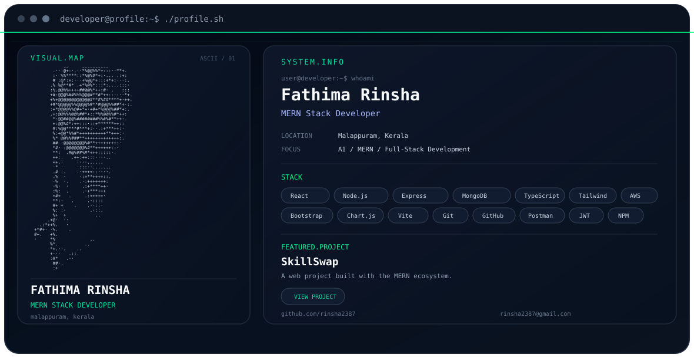

Fathima Rinsha
MERN Stack Developer • AI Explorer • Full-Stack Builder

  

  
  

🚀 About Me
👋 Hi, I'm Rinsha!
I'm a MERN Stack Developer passionate about building modern web applications and turning ideas into real-world projects.
- 💻 Building with React, Node.js, Express.js & MongoDB
- 🧠 Exploring AI and intelligent application development
- 📚 Always learning and improving my development skills
- 🚀 Focused on creating practical, modern and user-friendly applications
⚡ What I'm Focused On
<table>
<tr>
<td width="33%" align="center">

🤖 AI
Exploring AI-powered applications and intelligent development workflows.
</td>
<td width="33%" align="center">

🌐 MERN
Building full-stack applications with React, Node.js, Express & MongoDB.
</td>
<td width="33%" align="center">

🛠️ Full Stack
Turning ideas into complete, functional and scalable projects.
</td>
</tr>
</table>

🧩 Tech Stack
Languages

  

Frameworks & Libraries

  

Database & Tools

  

Also working with: Cloudinary • JWT • Chart.js • EJS
🌟 Featured Project
🔄 SkillSwap
A web project built with the MERN ecosystem.

  
  

📊 GitHub Activity

📫 Let's Connect

  
  

💚 Building. Learning. Improving. 🚀
Made with curiosity, code & continuous learning.

